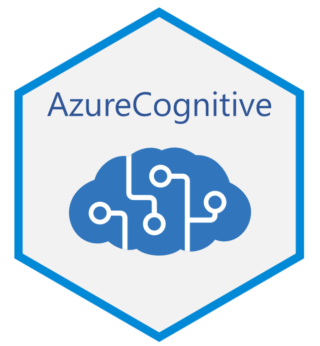

# AzureCognitive 

[](https://cran.r-project.org/package=AzureCognitive)


A package to work with [Azure Cognitive Services](https://azure.microsoft.com/services/cognitive-services/). Both a Resource Manager interface and a client interface to the REST API are provided.

The primary repo for this package is at https://github.com/Azure/AzureCognitive; please submit issues and PRs there. It is also mirrored at the Cloudyr org at https://github.com/cloudyr/AzureCognitive. You can install the development version of the package with `devtools::install_github("Azure/AzureCognitive")`.

## Resource Manager interface

AzureCognitive extends the class framework provided by [AzureRMR](https://github.com/Azure/AzureRMR) to support Cognitive Services. You can create, retrieve, update, and delete cognitive service resources by calling the corresponding methods for a resource group.

```r
az <- AzureRMR::get_azure_login()
sub <- az$get_subscription("sub_id")
rg <- sub$get_resource_group("rgname")

# create a new Computer Vision service
rg$create_cognitive_service("myvisionservice",
    service_type="ComputerVision", service_tier="S1")

# retrieve it
cogsvc <- rg$get_cognitive_service("myvisionservice")

# list subscription keys
cogsvc$list_keys()
```

## Client interface

AzureCognitive implements basic functionality for communicating with a cognitive service endpoint. While it can be called by the end-user, it is meant to provide a foundation for other packages that will support specific services, like Computer Vision, LUIS (language understanding), etc.

```r
# getting the endpoint from the resource object
endp <- cogsvc$get_endpoint()

# or standalone (must provide subscription key or other means of authentication)
endp <- cognitive_endpoint("https://myvisionservice.cognitiveservices.azure.com/",
    service_type="ComputerVision", key="key")

# analyze an image
img_link <- "https://news.microsoft.com/uploads/2014/09/billg1_print.jpg"
call_cognitive_endpoint(endp,
    operation="analyze",
    body=list(url=img_link),
    options=list(details="celebrities"),
    http_verb="POST")
```

```
$categories
$categories[[1]]
$categories[[1]]$name
[1] "people_"

$categories[[1]]$score
[1] 0.953125

$categories[[1]]$detail
$categories[[1]]$detail$celebrities
$categories[[1]]$detail$celebrities[[1]]
$categories[[1]]$detail$celebrities[[1]]$name
[1] "Bill Gates"

$categories[[1]]$detail$celebrities[[1]]$confidence
[1] 0.9999552
```

----
<p align="center"><a href="https://github.com/Azure/AzureR"></a></p>
